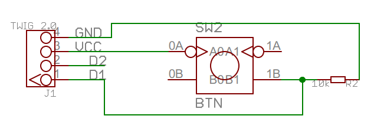

# Example: Push Button
## Things used in this project

In this tutorial, you are going to learn about interfacing the button with Arduino using the Arduino
digitalRead function.

 

## Links
 - https://www.hackster.io/bltrobotics/example-push-button-81e67b
 - https://create.arduino.cc/projecthub/muhammad-aqib/arduino-button-tutorial-using-arduino-digitalread-function-08adb5

## Story
On connecting the circuit in this way, we will get a LOW state when the button will not be pressed
and a HIGH state when the button will be pressed.

The circuit is same as the previous one, the only thing you need to change is connect the 10k
resistor to that side of button where you have connected the pin 2 of Arduino and connect the other
side of this 10k resistor to the ground of Arduino.

