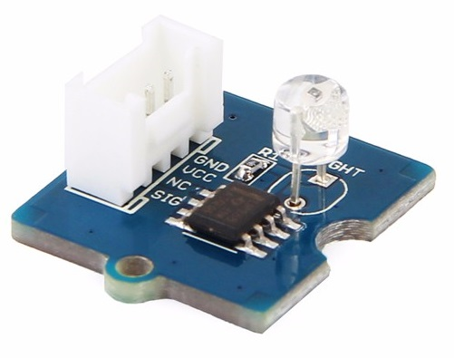
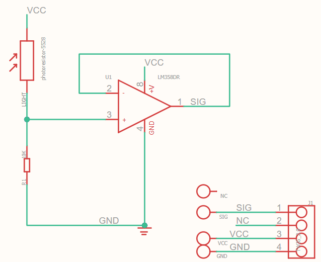

# Grove - Light Sensor

The Grove - Light sensor integrates a photo-resistor(light dependent resistor) to detect the intensity of light. The resistance of photo-resistor decreases when the intensity of light increases. A dual OpAmp chip LM358 on board produces voltage corresponding to intensity of light(i.e. based on resistance value). The output signal is analog value, the brighter the light is, the larger the value.

**Features**
  - Replace photoresistor-5528 with LS06-S
  - Analog value output
  - Recognize wider spectrum
  - Operating voltage	3 to 5 V
  - Operating current	0.5~3 mA
  - Response time	20-30 ms
  - Peak Wavelength	540 nm

  ## function AnalogWrite()

  After a call to __analogWrite()__, the pin will generate a steady rectangular wave of the specified duty cycle unitl tne next call to __analogWrite() (or a call to digitalWrite() or digitalRead()) on the same pin. 

  Nano Board has PWM pins 3,5,6,9,10, 11 with PWM frequency 490 Hz (pins 5 and 6: 980 Hz) 

